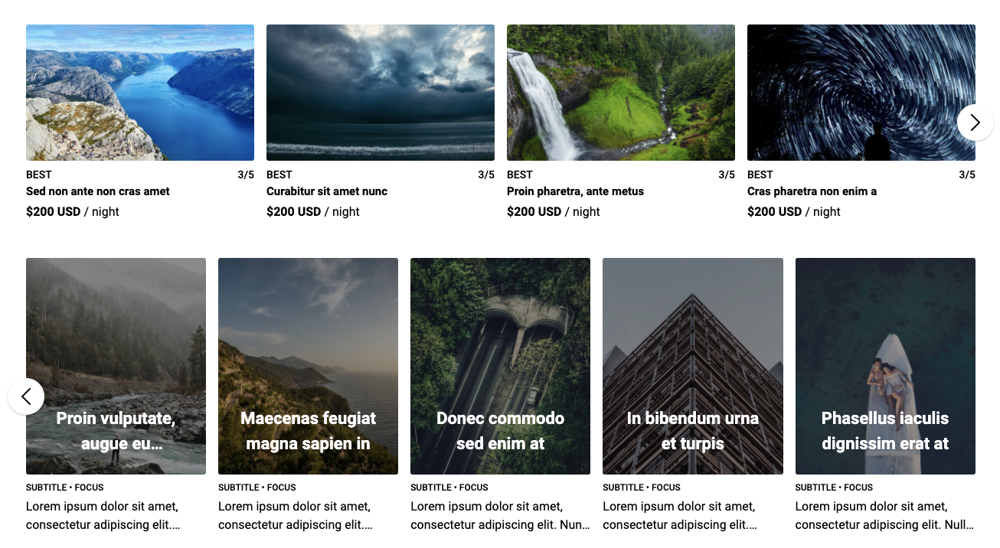

## 👋 You might want to use [Vue Horizontal](https://github.com/fuxingloh/vue-horizontal) instead!

[Vue Horizontal](https://github.com/fuxingloh/vue-horizontal)
is another take on the horizontal layout written by me with an ultra simple implementation that is extensible and moves the
responsibility to the user rather than the library.
With zero dependencies, 3 KB for CDN users it's built for your production needs.

[Vue Horizontal](https://github.com/fuxingloh/vue-horizontal) is a rewrite of this library with many more focus such as
end-to-end testing on real browsers, SSG/SSR CI testing to make sure all code is SSG/SSR compliant for your SEO!
Documentation are also extensible with everything you can think of about horizontal layout documentation through and through.

[Vue Horizontal](https://github.com/fuxingloh/vue-horizontal) also contains a snippet dossier with many SPA/SSR/SSG
friendly recipes for your design needs.
[Vue Horizontal](https://vue-horizontal.fuxing.dev/) is not just a library, **it's a place for everything horizontal.**

## Vue Horizontal List

A pure vue native horizontal list implementation for mobile/touch and responsive web.
Check it out here: [fuxingloh.github.io/vue-horizontal-list](https://fuxingloh.github.io/vue-horizontal-list/).

> I created this because I like how AirBnb does their horizontal list, I couldn't find a library that is simple and close to it.

[](https://github.com/prettier/prettier)
[](https://github.com/fuxingloh/vue-horizontal-list/blob/master/LICENSE)
[](https://github.com/fuxingloh/vue-horizontal-list/releases)
[](https://github.com/fuxingloh/vue-horizontal-list/graphs/contributors)
[](https://github.com/fuxingloh/vue-horizontal-list/issues)
[](https://fuxingloh.github.io/vue-horizontal-list/)
[](https://github.com/fuxingloh/vue-horizontal-list/actions?query=workflow%3ACI)

---

[](https://nuxt-app.now.sh/vue-horizontal-list)

## Installation

```shell script
npm i vue-horizontal-list
# or
yarn add vue-horizontal-list
```

Check out this [alternative project](https://github.com/fuxingloh/vue-horizontal) maintained by me for a new take on horizontal layout in vue.

#### Basic usage

```vue
<vue-horizontal-list
  :items="items"
  :options="{
    responsive: [
      { end: 576, size: 1 },
      { start: 576, end: 768, size: 2 },
      { size: 3 },
    ],
  }"
>
  <template v-slot:default="{item}">
    <div class="item">
      <h5>{{item.title}}</h5>
      <p>{{item.content}}</p>
    </div>
  </template>
</vue-horizontal-list>
```

## Features

- Lightweight implementation with 1 dependencies.
- SSR supported
- Mobile touch screen friendly
- Invisible scroll bar for consistent Windows and MacOS browsing experience.
- Snap to the nearest item in the horizontal-list when scrolling.
- Windowed & Full-screen mode
  - The windowed mode will respect the container and not show overflowing item
  - Full-screen mode will show overflowing item, best result for small screen
- Dynamic responsive breakpoint configuration
- Navigation control will show up dynamically for larger screen
- Touch screen friendly
- Slideshow autoplay by [@Draccano](https://github.com/Draccano).
- Slot different content at the beginning, or the ending of the items list by [@Draccano](https://github.com/Draccano).
- Minimal config setup
- Tested on chrome, edge and safari
- [Demo](https://fuxingloh.github.io/vue-horizontal-list/)
- [Examples](https://github.com/fuxingloh/vue-horizontal-list/tree/master/examples)

## All available options

```js
const options = {
  item: {
    // css class to inject into each individual item
    class: "",
    // padding between each item
    padding: 12,
  },
  list: {
    // css class for the parent of item
    class: "",
    // maximum width of the list it can extend to before switching to windowed mode, basically think of the bootstrap container max-width
    // windowed is used to toggle between full-screen mode and container mode
    windowed: 1200,
    // padding of the list, if container < windowed what is the left-right padding of the list
    // during full-screen mode the padding will added to left & right to centralise the item
    padding: 24,
  },
  responsive: [
    // responsive breakpoints to calculate how many items to show in the list at each width interval
    // it will always fall back to these:
    { end: 576, size: 1 },
    { start: 576, end: 768, size: 2 },
    { start: 768, end: 992, size: 3 },
    { start: 992, end: 1200, size: 4 },
    { start: 1200, size: 5 },
  ],
  navigation: {
    // when to show navigation
    start: 992,
    color: "#000",
  },
  position: {
    // Start from '1' on mounted.
    start: 1,
  },
  autoplay: {
    // enable/disable playing slideshow
    play: true,
    // the delay duration between slides in milliseconds
    speed: 1800,
    // if setup, the slideshow will be in the loop.
    repeat: true,
  },
};
```

## Advanced usage

```vue
<template>
  <div id="app">
    <section>
      <vue-horizontal-list :items="items" :options="options">
        <template v-slot:nav-prev>
          <div>👈</div>
        </template>

        <template v-slot:nav-next>
          <div>👉</div>
        </template>

        <template v-slot:start>
          <div>First Item</div>
        </template>

        <template v-slot:end>
          <div>Last Item</div>
        </template>

        <template v-slot:default="{ item }">
          <div class="item">
            <h5>{{ item.title }}</h5>
            <p>{{ item.content }}</p>
          </div>
        </template>
      </vue-horizontal-list>
    </section>
  </div>
</template>

<script>
import Vue from "vue";
import VueHorizontalList from "@/vue-horizontal-list.vue";

export default Vue.extend({
  name: "ServeDev",
  components: {
    VueHorizontalList,
  },
  data() {
    return {
      options: {
        responsive: [
          { end: 576, size: 1 },
          { start: 576, end: 768, size: 2 },
          { start: 768, end: 992, size: 3 },
          { size: 4 },
        ],
        list: {
          // 1200 because @media (min-width: 1200px) and therefore I want to switch to windowed mode
          windowed: 1200,

          // Because: #app {padding: 80px 24px;}
          padding: 24,
        },
        position: {
          start: 2,
        },
        autoplay: { play: true, repeat: true, speed: 2500 },
      },
      items: [
        { title: "Item 0", content: "Content item with description" },
        { title: "Item 1", content: "Content item with description" },
        { title: "Item 2", content: "Content item with description" },
      ],
    };
  },
});
</script>

<style>
body {
  margin: 0;
  padding: 0;
}

#app {
  max-width: 1400px;

  margin-left: auto;
  margin-right: auto;

  padding: 80px 24px;
}

@media (min-width: 1200px) {
  #app {
    padding-left: 80px;
    padding-right: 80px;
  }
}
</style>
```

## Development

```shell script
yarn # to setup
yarn run examples:serve # to dev and test
```

## Contributions

For any question or feature request please feel free to create an [issue](https://github.com/fuxingloh/vue-horizontal-list/issues/new) or [pull request](https://github.com/fuxingloh/vue-horizontal-list/pulls).
